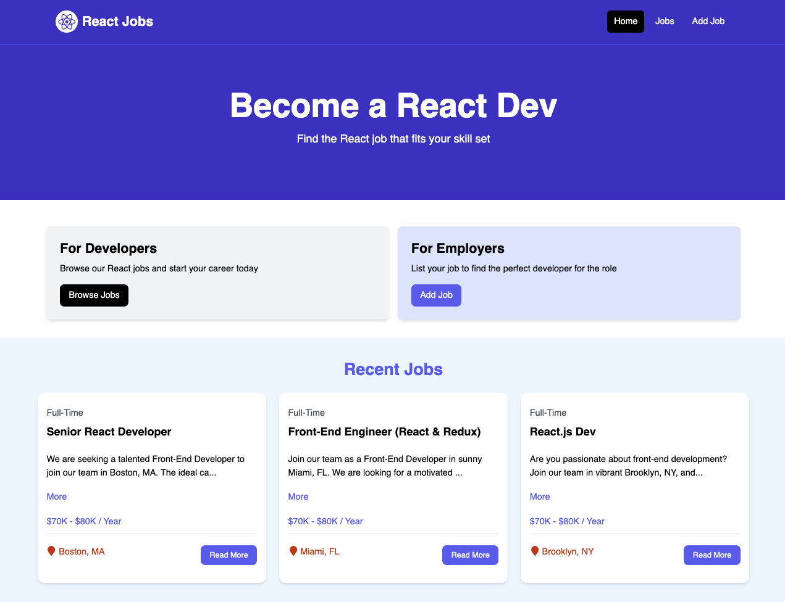

## SELF ASSISMANTS:

# Backend Code Self-Assessment - Soreen

## Example 1: Improving Error Handling in Job Controllers

Initially, our job controllers had basic error handling but lacked proper validation and specific error responses. Here's the original implementation:

```javascript
// controllers/jobControllers.js
async function getJobById(req, res) {
  try {
    const job = await Job.findById(req.params.id);
    res.status(200).json(job);
  } catch (error) {
    res.status(500).json({ message: error.message });
  }
}
```

The endpoint worked for valid ObjectIds but failed when:

- Invalid ObjectId format was provided (e.g., "invalid-id")
- Job with valid ObjectId didn't exist
- Database connection issues occurred

To address these issues, we refactored the code to handle edge cases effectively:

```javascript
// controllers/jobControllers.js
async function getJobById(req, res) {
  try {
    const job = await Job.findById(req.params.id);
    if (!job) {
      return res.status(404).json({ message: "Job not found" });
    }
    res.status(200).json(job);
  } catch (error) {
    if (error.name === "CastError") {
      return res.status(400).json({ message: "Invalid job ID format" });
    }
    res.status(500).json({ message: error.message });
  }
}
```

**Key Improvements:**

- **Null Check**: Added explicit check for job existence before returning response
- **Specific Error Handling**: Differentiated between CastError (invalid ID format) and other errors
- **Proper HTTP Status Codes**: Used 404 for not found, 400 for bad request, 500 for server errors

## Example 2: Improving Data Type Consistency

Our job model had inconsistent data typing for the salary field. Here's the original implementation:

```javascript
// models/jobModel.js
const jobSchema = new mongoose.Schema({
  title: { type: String, required: true },
  type: { type: String, required: true },
  location: { type: String, required: true },
  description: { type: String, required: true },
  salary: { type: String, required: true }, // Should be Number for calculations
  company: { type: companySchema, required: true },
});
```

The salary field was stored as String, which caused issues when:

- Performing salary range queries
- Sorting jobs by salary
- Mathematical operations on salary values

**Solution:**
We updated the schema to use the correct data type:

```javascript
// models/jobModel.js
const jobSchema = new mongoose.Schema({
  title: { type: String, required: true },
  type: { type: String, required: true },
  location: { type: String, required: true },
  description: { type: String, required: true },
  salary: { type: Number, required: true, min: 0 }, // Changed to Number with validation
  company: { type: companySchema, required: true },
});
```


**Key Improvements:**

- **Data Type Consistency**: Changed salary from String to Number for proper mathematical operations
- **Validation**: Added minimum value validation to prevent negative salaries
- **Query Performance**: Number fields are more efficient for range queries and sorting

# Front-end code - Minh 
## No problems happen with the front-end code , i just have some problems during calling it on the webiste but problems solve
//LoginPage.jsx
const LoginPage = () => {
  const [email, setEmail] = useState("");
  const [password, setPassword] = useState("");
  const [error, setError] = useState(null);

  const navigate = useNavigate();
  const { dispatch } = useContext(AuthContext);

  const submitForm = async (e) => {
    e.preventDefault();

    console.log("LOGIN FORM DATA:", { email, password });
    try {
      const res = await fetch("/api/auth/login", {
        method: "POST",
        headers: { "Content-Type": "application/json" },
        body: JSON.stringify({ email, password }),
      });
      if (!res.ok) {
        throw new Error("Login failed");
      }
      const data = await res.json();
      console.log(data);
      dispatch({ type: "LOGIN", payload: data });
      navigate("/");
    } catch (err) {
      setError(err.message);
    }
  };

  return (
    <section className="bg-indigo-50 min-h-screen">
      <div className="container m-auto max-w-md py-10">
        <div className="bg-white px-6 py-8 shadow-md rounded">
          <h2 className="text-3xl text-center font-semibold mb-6">Login</h2>

          <form onSubmit={submitForm}>
            <div className="mb-4">
              <label
                htmlFor="email"
                className="block text-gray-700 font-bold mb-2"
              >
                Email
              </label>
              <input
                id="email"
                name="email"
                type="email"
                className="border rounded w-full py-2 px-3"
                placeholder="you@example.com"
                value={email}
                onChange={(e) => setEmail(e.target.value)}
                required
              />
            </div>

            <div className="mb-6">
              <label
                htmlFor="password"
                className="block text-gray-700 font-bold mb-2"
              >
                Password
              </label>
              <input
                id="password"
                name="password"
                type="password"
                className="border rounded w-full py-2 px-3"
                placeholder="Your password"
                value={password}
                onChange={(e) => setPassword(e.target.value)}
                required
                minLength={6}
              />
            </div>

            <button
              type="submit"
              className="w-full bg-indigo-600 hover:bg-indigo-700 text-white font-medium py-2.5 rounded"
            >
              Log In
            </button>
          </form>

          <p className="text-center text-sm mt-4">
            Don’t have an account?{" "}
            <Link to="/signup" className="text-indigo-600 hover:underline">
              Sign up
            </Link>
          </p>
        </div>
      </div>
    </section>
  );
};

//

//SignUpPage Code 
const SignupPage = () => {
  const [name, setName] = useState("");
  const [email, setEmail] = useState("");
  const [password, setPassword] = useState("");
  const [phone, setPhone] = useState("");
  const [gender, setGender] = useState("");
  const [dob, setDob] = useState("");
  const [membership, setMembership] = useState("Free");

  const { dispatch } = useContext(AuthContext);
  const navigate = useNavigate();
  const [error, setError] = useState(null);

  const submitForm = async (e) => {
    e.preventDefault();

    const newUser = {
      name,
      email,
      password,
      phone_number: phone,
      gender,
      date_of_birth: dob,
      membership_status: membership,
    };
    console.log("SIGNUP FORM DATA:", newUser);
    try {
      const res = await fetch("/api/auth/register", {
        method: "POST",
        headers: { "Content-Type": "application/json" },
        body: JSON.stringify(newUser),
      });
      if (!res.ok) {
        throw new Error("Signup failed");
      }
      const data = await res.json();

      dispatch({ type: "LOGIN", payload: data });
      navigate("/");
    } catch (err) {
      setError(err.message);
    }
  };

  return (
    <section className="bg-indigo-50 min-h-screen">
      <div className="container m-auto max-w-2xl py-10">
        <div className="bg-white px-6 py-8 shadow-md rounded">
          <h2 className="text-3xl text-center font-semibold mb-6">Sign Up</h2>

          <form onSubmit={submitForm}>
            {/* Name */}
            <div className="mb-4">
              <label
                htmlFor="name"
                className="block text-gray-700 font-bold mb-2"
              >
                Full Name
              </label>
              <input
                id="name"
                name="name"
                type="text"
                className="border rounded w-full py-2 px-3"
                placeholder="Your full name"
                value={name}
                onChange={(e) => setName(e.target.value)}
                required
              />
            </div>

            {/* Email */}
            <div className="mb-4">
              <label
                htmlFor="email"
                className="block text-gray-700 font-bold mb-2"
              >
                Email
              </label>
              <input
                id="email"
                name="email"
                type="email"
                className="border rounded w-full py-2 px-3"
                placeholder="you@example.com"
                value={email}
                onChange={(e) => setEmail(e.target.value)}
                required
              />
            </div>

            {/* Password */}
            <div className="mb-4">
              <label
                htmlFor="password"
                className="block text-gray-700 font-bold mb-2"
              >
                Password
              </label>
              <input
                id="password"
                name="password"
                type="password"
                className="border rounded w-full py-2 px-3"
                placeholder="Minimum 6 characters"
                value={password}
                onChange={(e) => setPassword(e.target.value)}
                required
                minLength={6}
              />
            </div>

            {/* Phone */}
            <div className="mb-4">
              <label
                htmlFor="phone"
                className="block text-gray-700 font-bold mb-2"
              >
                Phone Number
              </label>
              <input
                id="phone"
                name="phone"
                type="tel"
                className="border rounded w-full py-2 px-3"
                placeholder="e.g. +358401234567"
                value={phone}
                onChange={(e) => setPhone(e.target.value)}
                required
              />
            </div>

            {/* Gender */}
            <div className="mb-4">
              <span className="block text-gray-700 font-bold mb-2">Gender</span>
              <div className="flex gap-6">
                <label className="inline-flex items-center gap-2">
                  <input
                    type="radio"
                    name="gender"
                    value="Male"
                    checked={gender === "Male"}
                    onChange={(e) => setGender(e.target.value)}
                    required
                  />
                  <span>Male</span>
                </label>
                <label className="inline-flex items-center gap-2">
                  <input
                    type="radio"
                    name="gender"
                    value="Female"
                    checked={gender === "Female"}
                    onChange={(e) => setGender(e.target.value)}
                    required
                  />
                  <span>Female</span>
                </label>
                <label className="inline-flex items-center gap-2">
                  <input
                    type="radio"
                    name="gender"
                    value="Other"
                    checked={gender === "Other"}
                    onChange={(e) => setGender(e.target.value)}
                    required
                  />
                  <span>Other</span>
                </label>
              </div>
            </div>

            {/* Date of Birth */}
            <div className="mb-4">
              <label
                htmlFor="dob"
                className="block text-gray-700 font-bold mb-2"
              >
                Date of Birth
              </label>
              <input
                id="dob"
                name="dob"
                type="date"
                className="border rounded w-full py-2 px-3"
                value={dob}
                onChange={(e) => setDob(e.target.value)}
                required
              />
            </div>

            {/* Membership Status */}
            <div className="mb-6">
              <label
                htmlFor="membership"
                className="block text-gray-700 font-bold mb-2"
              >
                Membership Status
              </label>
              <select
                id="membership"
                name="membership"
                className="border rounded w-full py-2 px-3"
                value={membership}
                onChange={(e) => setMembership(e.target.value)}
                required
              >
                <option value="Free">Free</option>
                <option value="Premium">Premium</option>
                <option value="VIP">VIP</option>
              </select>
            </div>

            <button
              type="submit"
              className="w-full bg-indigo-600 hover:bg-indigo-700 text-white font-medium py-2.5 rounded"
            >
              Create Account
            </button>
          </form>

          <p className="text-center text-sm mt-4">
            Already have an account?{" "}
            <Link to="/login" className="text-indigo-600 hover:underline">
              Log in
            </Link>
          </p>
        </div>
      </div>
    </section>
  );
};
//
# Minh back-end code 
Problems : i got some problems during the SignUp and Login , the back-end did not receive the info i gave , i have fixed it with the help of Sorin and Aashish , i fixed it in the AuthContext.jsx and also in the AddJobPage.jsx and JobPage.jsx , i have to refactored code in these files and also fixing bugs for them to running , everthing wnet well by that time 

# React Jobs Project

## Usage

### Mock Server

1. Open a terminal in the `backend/api-fake-server` directory

2. Install Dependencies

```bash
npm install
```

3. Start the JSON-Server

```bash
npm run dev
```

4. The server will run on http://localhost:8000

### Frontend-simplified and/or Frontend

1. Open another terminal in the `frontend` directory (or `frontend-simplified`)

2. Install Dependencies

```bash
npm install
```

3. Start the App

```bash
npm run dev
```

React will run on http://localhost:3000

### Api Server

1. Open another terminal in the `backend/api-server-starter` directory

2. Install Dependencies

```bash
npm install
```

3. Start the Server

```bash
npm run dev
```

4. The server will run on http://localhost:4000

---

## Other

### Build for Production

```bash
npm run build
```

### Preview Production Build

```bash
npm run preview
```

### About

This is the jobs listing project based on the [YouTube crash course](https://youtu.be/LDB4uaJ87e0).


